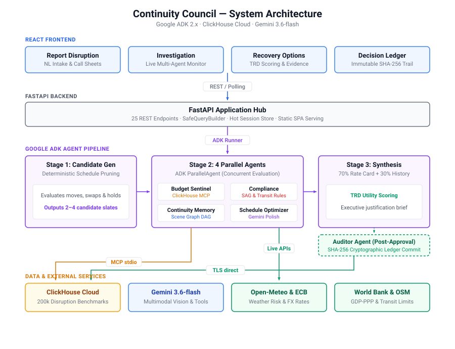

# Continuity Council

**Autonomous film production disruption recovery, schedule optimization, and economic risk intelligence.**

[](https://www.python.org/downloads/)
[](https://opensource.org/licenses/MIT)
[](https://cloud.google.com/vertex-ai)
[](https://deepmind.google/technologies/gemini/)
[](https://clickhouse.com/)
[](tests/)
[](frontend/)
[](backend/)

> **Agentic Cinema: The Blockbuster Hackathon 2026 — ClickHouse Track**

---

## 🎬 One-Paragraph Pitch

Continuity Council is an autonomous multi-agent recovery platform designed for film producers, line producers, and unit production managers (UPMs) facing high-stakes shooting disruptions. When unpredicted weather, talent unavailability, transit bottlenecks, or location permit closures strike, production delay costs quickly exceed **$100,000 to $500,000+ per day**. Instead of relying on generic chat assistants or manual phone trees, Continuity Council deploys an autonomous **6-agent ADK pipeline** grounded in **200,000 ClickHouse historical disruption benchmarks** and live macroeconomic rate cards to formulate, rank, compliance-check, and seal optimal recovery slates in under 15 seconds.

---

## 🏛️ System Architecture

<p align="center">
  
</p>

---

## 🌟 Key Features

### 🎬 Autonomous 6-Agent Investigation Pipeline
- **Google ADK Orchestration**: Composes sequential and parallel sub-agent workflows using `google-adk` 2.x (`SequentialAgent`, `ParallelAgent`, and `BaseAgent`).
- **Concurrent Specialist Deliberation**: In Stage 2, four specialist agents (Budget Sentinel, Compliance Sentinel, Continuity Memory, and Schedule Optimizer) execute in parallel to evaluate candidates across union rules, narrative flow, and financial risk.
- **Human-in-the-Loop Governance**: Agents propose calibrated candidate recovery slates; no state changes or schedule mutations are ever committed without explicit human Producer authorization.

### 📊 ClickHouse-Grounded Financial Reasoning
- **200,000-Row Empirical Corpus**: Grounded in 200,000 realistic historical disruption records across global studios, budget tiers, and shooting environments stored in ClickHouse Cloud.
- **Sub-Millisecond Materialized Aggregations**: Powers real-time evidence synthesis via the `strategy_performance_mv` `AggregatingMergeTree` materialized view with `avgState` and `countState` aggregates.
- **Official MCP Integration**: The Budget Sentinel queries ClickHouse at runtime via the official `mcp-clickhouse` FastMCP stdio client.
- **Zero-Injection SafeQueryBuilder**: Strictly enforces parameterized allowlisted query templates, ensuring the LLM never executes raw or unvalidated SQL strings.

### 🧠 7 Distinct Gemini 3.6-flash Use Cases
1. **Multimodal PDF Call-Sheet Vision**: Extracts shoot days, scenes, cast requirements, and location logistics from raw shooting schedules.
2. **Natural Language Disruption Intake**: Parses ambiguous field reports (e.g., *"Lena has flu on Day 2, pier flooded"*) into structured parameters.
3. **Structured Candidate Narrative Generation**: Synthesizes clean, producer-grade descriptions of schedule shifts and company moves.
4. **Executive Justification Synthesis**: Produces concise trade-off explanations grounding recommendations against ClickHouse historical precedent.
5. **Multi-Turn Function-Calling Chatbot**: Multimodal copilot with 4 live tools to inspect schedules, query ClickHouse benchmarks, and evaluate weather.
6. **Gemini TTS Voice Briefings**: Generates on-demand streaming audio executive briefings for on-the-go line producers.
7. **DAG Constraint & Arc Reasoning**: Understands complex character emotional arcs, time-of-day lighting, and script sequence dependencies.

### 💰 Empirical 70/30 Economic Calibration
- **70% Bottom-Up Union Rate Cards**: Estimates hard crew day rates, SAG-AFTRA Schedule F performer minimums, overtime multipliers, and soundstage rental fees.
- **30% ClickHouse Empirical Precedent**: Blends bottom-up costs with historical mean overrun distributions from 200k past industry disruptions.
- **Live Meteorological & FX Integration**: Queries Open-Meteo for 16-day precipitation risks and Frankfurter (ECB) for real-time currency conversions.
- **World Bank GDP-PPP Scaling**: Automatically scales local labor and venue fees using World Bank purchasing power parity indices across 6 global production hubs.

### ⚖️ TRD Utility Scoring Formula
All candidate recovery options are ranked using a multi-dimensional utility formula:

```text
Score = 0.40 × Cost_Saving + 0.30 × Delay_Saving + 0.20 × Continuity_Safety + 0.10 × Compliance_Safety
```

- **Normalized Bounds**: Cost and delay savings are normalized against the candidate set ($[0, 1]$ where $1.0$ is the optimal boundary).
- **Compliance Hard Constraint**: Options violating mandatory SAG-AFTRA turnaround (12h rest) or 100-mile same-day transit limits receive an automatic 75% hard-penalty multiplier ($\times 0.25$) and a prominent non-compliance warning badge.
- **Transparent & Explainable**: Completely deterministic ranking—zero black-box opacity.

### 🔒 Tamper-Evident Audit Ledger
- **Cryptographic State Sealing**: Every approved recovery decision generates a deterministic SHA-256 hash envelope of the case state, recovery payload, timestamp, and authorizer.
- **Isolated Post-Approval Execution**: The Auditor Agent executes strictly post-approval, committing immutable records to the ClickHouse `decision_ledger` and `schedule_changes` tables.
- **Permanent Provenance**: Provides an unalterable audit trail for studio executives, completion bond guarantors, and insurance adjusters.

### 🌍 Global Production Support
- **6 Pre-Loaded Production Tenants**: Spans indie features to \$200M tentpoles filmed across Los Angeles, Abu Dhabi, London, Berlin, Maine, and Vancouver.
- **Multi-Currency Support**: Real-time handling of USD (\$), GBP (£), EUR (€), CAD (C\$), AED (د.إ), and JOD (JD).
- **Studio Tenant Isolation**: Supports tenant-specific disruption history cohorts with automatic cold-start Bayesian blending into global industry baselines.

### 💬 Grounded AI Council Chatbot
- **Native Tool Calling**: Equipped with Gemini function calling to query production states, fetch ClickHouse benchmarks, and retrieve live forecasts.
- **Context-Aware Follow-ups**: Retains multi-turn conversation memory for complex hypothetical inquiries (*"What if we push Day 2 scenes to Day 4 instead?"*).
- **Integrated Voice Synthesis**: Native TTS playback button for listening to executive summaries hands-free on set.

---

## 🛠️ Tech Stack

| Layer | Technology | Purpose |
|---|---|---|
| **Agent Framework** | **Google ADK 2.x** (`google-adk`) | `SequentialAgent` and `ParallelAgent` multi-agent council orchestration |
| **Foundation LLM** | **Google Gemini 3.6-flash** (`google-genai`) | 7 multimodal and agentic reasoning workflows |
| **Analytical Database** | **ClickHouse Cloud** (`clickhouse-connect`) | High-throughput 200,000-row benchmark storage & immutable audit ledger |
| **MCP Tool Integration** | **FastMCP / mcp-clickhouse** (Official) | Model Context Protocol tool calling over stdio |
| **Backend Framework** | **FastAPI + Uvicorn** | 25 REST endpoints, async SSE streaming, and static SPA serving |
| **Frontend Framework** | **React 18 + Tailwind CSS + Lucide** | 6 reactive studio screens, dark aesthetic, and Apple-grade micro-interactions |
| **Meteorological Signals** | **Open-Meteo API** | Real-time weather forecasting and precipitation threshold evaluation |
| **Foreign Exchange** | **Frankfurter API (European Central Bank)** | Live currency conversion across 6 production currencies |
| **Geocoding & Transit** | **OpenStreetMap Nominatim** | Haversine distance, city tiering, and 100-mile transit rule enforcement |
| **Macroeconomics** | **World Bank GDP-PPP API** | Country labor index multipliers for authentic global cost modeling |
| **Automated Testing** | **Pytest + Jest** | 104 backend tests + 32 frontend unit/integration test suites |

---

## 🗄️ ClickHouse Schema Architecture

The ClickHouse database (`continuity_council`) consists of **11 tables** and **1 materialized view**:

| Table / View | Engine | Primary Sort Key | Purpose |
|---|---|---|---|
| `productions` | `MergeTree` | `production_id` | Production tenants, tier (indie/mid/tentpole), currency, and shoot parameters |
| `locations` | `MergeTree` | `(production_id, location_id)` | Filming locations, coordinates, city tiers, and local geo multipliers |
| `cast_members` | `MergeTree` | `(production_id, cast_id)` | Cast rosters, role types (lead/supporting), and daily union rates |
| `rate_cards` | `MergeTree` | `(tier, item)` | Published industry rate card benchmarks (SAG-AFTRA, IATSE, soundstage fees) |
| `production_schedule` | `MergeTree` | `(production_id, shoot_day, scene_id)` | Scenes, sequence order, cast requirements, continuity tags, and dependency DAGs |
| `location_availability` | `MergeTree` | `(production_id, location_id, shoot_day)` | Daily location permit calendars and availability locks |
| `cast_availability` | `MergeTree` | `(production_id, cast_id, shoot_day)` | Talent availability matrix and blackout days |
| `disruption_history` | `MergeTree` | `(disruption_type, resolution_strategy, created_at)` | **200,000 historical disruption benchmarks** across industry productions |
| `strategy_performance_mv` | `AggregatingMergeTree` | `(disruption_type, strategy, severity)` | Materialized aggregates (`avgState`, `countState`) for sub-millisecond MCP lookups |
| `disruption_cases` | `MergeTree` | `(production_id, created_at)` | Active and resolved production disruption cases |
| `decision_ledger` | `MergeTree` | `(production_id, approved_at)` | **Immutable decision audit ledger** storing SHA-256 cryptographic signatures |
| `schedule_changes` | `MergeTree` | `(production_id, created_at)` | Granular scene-level move log tracking original vs. updated shoot days/locations |

---

## 🤖 Agent Pipeline Detail

The council operates via **8 specialized agents** collaborating across sequential and parallel stages:

| Agent | Stage | Framework | Core Responsibilities & Tools |
|---|---|---|---|
| **Orchestrator** | Coordinator | ADK `SequentialAgent` | Master coordinator executing the multi-stage investigation pipeline via `Runner.run_async`. |
| **Candidate Generator** | Stage 1 | ADK `BaseAgent` | Deterministically generates 2–4 candidate recovery slates (cover scenes, location moves, day swaps, resource holds). |
| **Budget Sentinel** | Stage 2 (Parallel) | ADK `BaseAgent` | Queries ClickHouse via official `mcp-clickhouse` and `SafeQueryBuilder` to evaluate empirical cost and delay risks. |
| **Compliance Sentinel** | Stage 2 (Parallel) | ADK `BaseAgent` | Deterministic constraint solver enforcing SAG-AFTRA turnaround rules, permit bounds, and 100-mile transit limits. |
| **Continuity Memory** | Stage 2 (Parallel) | ADK `BaseAgent` | Analyzes script DAG dependencies, character emotional arcs, wardrobe continuity, and daylight lighting constraints. |
| **Schedule Optimizer** | Stage 2 (Parallel) | ADK `BaseAgent` | Balances daily scene density and generates producer-grade candidate descriptions via structured Gemini calls. |
| **Synthesis Agent** | Stage 3 (Sequential) | ADK `BaseAgent` | Combines 70% rate cards + 30% ClickHouse history, computes TRD utility scores, and synthesizes executive rationale. |
| **Auditor Agent** | Post-Approval | ADK `BaseAgent` | Executes strictly after human sign-off; generates SHA-256 seal and commits atomic records to ClickHouse. |
| **Council Chatbot** | On-Demand | Standalone Async Copilot | Interactive copilot utilizing Gemini native function calling (4 live tools) and streaming TTS audio synthesis. |

---

## 🚀 Quick Start

### Prerequisites
- Python 3.11+
- Node.js 18+ and Yarn
- ClickHouse Cloud instance (or local ClickHouse 24+)
- Google Gemini API Key ([Google AI Studio](https://aistudio.google.com/app/apikey))

### 1. Clone & Install Dependencies
```bash
git clone https://github.com/25u1022-tech/continuity-council.git
cd continuity-council

# Install backend dependencies
pip install -r backend/requirements.txt

# Install frontend dependencies
cd frontend && yarn install && cd ..
```

### 2. Configure Environment Variables
```bash
cp .env.example backend/.env
```
Edit `backend/.env` with your real credentials:
```env
CLICKHOUSE_HOST=your-instance.clickhouse.cloud
CLICKHOUSE_PASSWORD=your-password
GEMINI_API_KEY=AIzaSy...
```

### 3. Seed ClickHouse with 200,000 Records
```bash
python clickhouse/seed.py
```
*Seeds all 11 tables, rate cards, 6 global productions, and 200,000 historical disruption benchmarks.*

### 4. Start Development Servers

**Windows (One-Click):**
```cmd
dev.bat
```

**Manual Start:**
```bash
# Terminal 1 — Backend
cd backend && uvicorn server:app --host 0.0.0.0 --port 8000 --reload

# Terminal 2 — Frontend
cd frontend && yarn start
```

### 5. Access the Application
Open [http://localhost:3000](http://localhost:3000) in your browser.

---

## 🎯 Guided Demo Walkthrough (For Judges)

Follow these steps for the optimal evaluation flow:

1. **Select Production**:
   - Open the **Dashboard** and switch the production to **`prod_002` ("IRON HORIZON")** or **`prod_001` ("The Long Dark Take")**.
2. **Report a Disruption**:
   - Navigate to **Report Disruption** (`/report`).
   - Try natural language: *"Sandstorm warning at Dune Perimeter on Day 12, unit unable to film exterior scenes."*
   - Notice the automated parameter extraction and affected scene preview.
   - Click **"Dispatch Investigation Council"**.
3. **Watch Real-Time Investigation**:
   - The UI automatically redirects to the **Investigation Monitor** (`/investigation`).
   - Observe the 4 specialist agents executing concurrently in Stage 2 with live thought logging and MCP ClickHouse query latencies.
4. **Evaluate Recovery Options**:
   - On the **Recovery Options** (`/options`) screen, review the 2–4 ranked options.
   - Inspect the **TRD Scores**, calibrated cost estimates (70% rate-card / 30% ClickHouse), and compliance badges.
   - Click any row in the right-hand **Historical Evidence (ClickHouse)** table to open the raw data drilldown modal.
   - Click the **Listen Briefing** button to hear the Gemini TTS executive summary.
5. **Approve & Seal Decision**:
   - Click **"Approve & Record"** on the recommended option.
   - The Auditor Agent commits the SHA-256 tamper-evident record to ClickHouse.
6. **Inspect Immutable Ledger**:
   - Navigate to the **Decision Ledger** (`/ledger`) to view the cryptographic hash, approved scene delta, and timestamp.
7. **Interact with Council Copilot**:
   - Open the floating chatbot widget at the bottom right.
   - Ask: *"Explain why option 1 was ranked higher than option 2"* or *"Check weather for tomorrow's shoot"*.

---

## ⚙️ Environment Configuration

| Variable | Required | Default | Description |
|---|---|---|---|
| `CLICKHOUSE_HOST` | **Required** | — | ClickHouse Cloud endpoint hostname (e.g., `xxx.clickhouse.cloud`) |
| `CLICKHOUSE_PASSWORD` | **Required** | — | ClickHouse database password |
| `GEMINI_API_KEY` | **Required** | — | Google Gemini API key from [Google AI Studio](https://aistudio.google.com/app/apikey) |
| `CLICKHOUSE_PORT` | Optional | `8443` | ClickHouse HTTPS native protocol port (8443 for Cloud TLS, 8123 for HTTP) |
| `CLICKHOUSE_DATABASE` | Optional | `continuity_council` | Target ClickHouse database name |
| `CLICKHOUSE_USER` | Optional | `default` | ClickHouse username |
| `CLICKHOUSE_SECURE` | Optional | `true` | Enforce TLS connection (`true` for ClickHouse Cloud, `false` for local) |
| `GEMINI_MODEL` | Optional | `gemini-3.6-flash` | Gemini model identifier for multi-agent council deliberation |
| `TTS_MODEL` | Optional | `gemini-2.5-flash-preview-tts` | Gemini model identifier for text-to-speech voice synthesis |
| `TTS_VOICE` | Optional | `Kore` | Default voice identifier for audio briefings (`Kore`, `Puck`, `Fenrir`, etc.) |
| `TTS_TIMEOUT_SECONDS` | Optional | `25.0` | Maximum timeout in seconds for on-demand audio briefing generation |
| `PORT` | Optional | `8080` | Port for FastAPI backend server (`8080` on Cloud Run, `8000` local dev) |
| `ALLOWED_ORIGINS` | Optional | `http://localhost:3000,http://localhost:8000` | Comma-separated list of allowed CORS browser origins |
| `CORS_ORIGINS` | Optional | — | Legacy backward-compatible alias for `ALLOWED_ORIGINS` |
| `FRONTEND_BUILD_DIR` | Optional | `../frontend/build` | Relative or absolute path to built React static assets |


---

## 🧪 Automated Testing & Verification

Continuity Council includes extensive automated backend and frontend test suites.

```bash
# Run backend pytest suite (104 tests)
python -m pytest tests/ -v

# Run frontend test suite (32 tests)
cd frontend && yarn test --watchAll=false
```

### Backend Test Coverage Breakdown (`tests/`)

- **`TestGenerateScheduleOptions`**: Verifies deterministic generation of 2–4 candidate recovery slates under various disruption conditions.
- **`TestOptionScoring`**: Verifies exact mathematical implementation of the TRD weighted utility formula and compliance hard-penalties.
- **`TestComplianceValidation`**: Validates SAG-AFTRA 12-hour turnaround rules, working hour limits, and location permit calendar boundaries.
- **`TestContinuityRiskScoring`**: Evaluates scene DAG dependency validation, wardrobe/hair continuity, and time-of-day constraints.
- **`TestDistanceCompliance`**: Validates Haversine geographic transit calculations and the 100-mile same-day transit limit.
- **`TestRateCardsAndEconomics`**: Verifies bottom-up IATSE/SAG rate card estimations across indie, mid, and tentpole tiers.
- **`TestExternalSignals`**: Tests Open-Meteo weather risk parsing and Frankfurter/ECB foreign currency conversion.
- **`TestGlobalGeoCosting`**: Validates World Bank GDP-PPP macroeconomic multipliers and country factor scaling.
- **`TestSafeQueryBuilder` & `TestSafeQueryBuilderStudioIsolation`**: Verifies SQL injection defense and studio tenant cohort isolation.
- **`TestCouncilChatbot`**: Tests Gemini function calling, live tool dispatch, and conversational fallback resilience.
- **`TestExplainabilityJustification`**: Validates Gemini executive rationale generation and deterministic fallback behavior.
- **`TestNLDisruptionParser`**: Tests structured parameter extraction from natural language field reports.
- **`TestSchedulePDFExtractor`**: Tests PDF validation, byte limits, and Gemini Vision schedule extraction schemas.
- **`TestTTSService`**: Validates text hashing, audio caching, and non-blocking speech synthesis.
- **`TestCsvValidationAndImport` & `TestColdStartBlendingMath`**: Validates historical CSV ingestion and Bayesian cohort blending mathematics.

---

## 📂 Project Directory Structure

```
continuity-council/
├── backend/
│   ├── agents/                  # 8 Google ADK council agents
│   │   ├── orchestrator.py      # Master ADK SequentialAgent coordinator
│   │   ├── budget_sentinel.py   # ClickHouse MCP historical analytics agent
│   │   ├── compliance.py        # Union & transit constraint solver
│   │   ├── continuity_memory.py # Scene DAG & narrative continuity engine
│   │   ├── schedule_optimizer.py# Schedule balancing & description generator
│   │   ├── auditor.py           # Post-approval cryptographic ledger agent
│   │   └── council_chatbot.py   # Multi-turn tool-calling conversational copilot
│   ├── services/                # Specialized domain services
│   │   ├── clickhouse_client.py # Direct ClickHouse driver & schema manager
│   │   ├── gemini_client.py     # Google GenAI SDK wrapper (structured output)
│   │   ├── mcp_client.py        # FastMCP client for @clickhouse/mcp-server
│   │   ├── safe_query_builder.py# Parameterized SQL template builder
│   │   ├── tts_service.py       # Gemini TTS streaming voice engine
│   │   ├── weather_service.py   # Open-Meteo meteorological risk integration
│   │   ├── finance_service.py   # Frankfurter ECB currency & rate card pricing
│   │   ├── geo_service.py       # OpenStreetMap Nominatim & Haversine routing
│   │   ├── import_service.py    # Historical CSV data importer & blending
│   │   └── schedule_extractor.py# Multimodal PDF call-sheet parser
│   ├── case_store.py            # In-memory active session state manager
│   ├── models.py                # Pydantic data schemas
│   ├── scoring.py               # TRD utility scoring implementation
│   ├── server.py                # FastAPI app (25 REST endpoints + static SPA)
│   └── requirements.txt         # Clean, pinned Python dependencies
├── frontend/
│   ├── src/
│   │   ├── components/          # Reusable UI components & modals
│   │   │   ├── CouncilChatbot.jsx# Floating AI copilot with TTS audio
│   │   │   ├── EvidenceTable.jsx# ClickHouse historical evidence bars
│   │   │   ├── EvidenceDrilldown.jsx# Raw 200k record inspector modal
│   │   │   └── LocationMapPicker.jsx# Leaflet location & transit visualizer
│   │   ├── pages/               # 6 core production screens
│   │   │   ├── LandingPage.js   # Production overview & switcher
│   │   │   ├── DashboardPage.js # Real-time shoot schedule & risk meters
│   │   │   ├── ReportDisruptionPage.js # NL & multimodal disruption intake
│   │   │   ├── InvestigationPage.js    # Live multi-agent thought monitor
│   │   │   ├── RecoveryOptionsPage.jsx # TRD ranked slates & audio briefs
│   │   │   ├── DecisionLedgerPage.js   # SHA-256 cryptographic audit trail
│   │   │   └── DataMethodologyPage.jsx # Technical documentation screen
│   │   └── lib/api.js           # API client & relative/proxy routing
│   └── package.json             # React 18 & Craco configuration
├── clickhouse/
│   ├── schema.sql               # 11 tables + 1 AggregatingMergeTree MV
│   └── seed.py                  # 200,000-row deterministic data seeder
├── docs/
│   └── architecture.svg         # High-resolution system architecture diagram
├── tests/                       # 104 automated pytest test cases
├── Dockerfile                   # Multi-stage production container for Cloud Run
├── cloudbuild.yaml              # Google Cloud Build CI/CD configuration
├── Procfile                     # Process definition for container runtimes
├── LICENSE                      # MIT Open Source License
└── .env.example                 # Environment variables reference template
```

---

## 📄 License & Hackathon Submission

Distributed under the **MIT License**. See [`LICENSE`](LICENSE) for details.

**Built for Agentic Cinema: The Blockbuster Hackathon 2026**  
*Google Cloud × ClickHouse Track*  
Created by Team Continuity Council.
