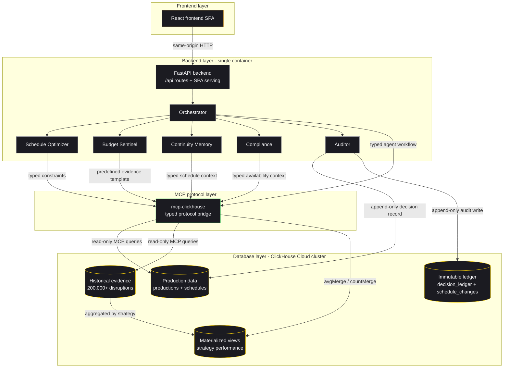

# Continuity Council architecture

MCP provides a typed, observable protocol boundary between the agent council and ClickHouse instead of allowing agents to compose raw SQL. Predefined parameterized tools preserve provenance, prevent hallucinated queries, and keep evidence access read-only and auditable.
