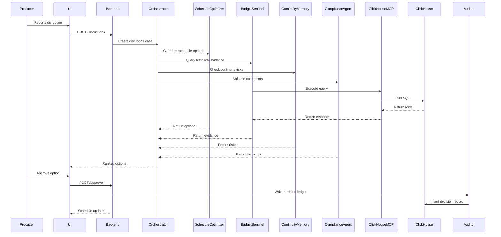

<!-- 03_app_flow.md -->
# Application Flow

## High-Level Flow

```text
Producer reports disruption
        ↓
Backend creates disruption case
        ↓
Orchestrator Agent starts investigation
        ↓
Specialist agents run in parallel:
  - Schedule Optimizer
  - Budget Sentinel
  - Continuity Memory
  - Compliance Agent
        ↓
Orchestrator merges findings
        ↓
Orchestrator ranks recovery options
        ↓
Producer reviews options
        ↓
Producer approves one option
        ↓
Schedule update is generated
        ↓
Auditor Agent writes decision ledger
        ↓
Dashboard shows final decision and audit trail
```

---

## User Journey

### Step 1: Producer Opens Dashboard

The producer sees:

- Production title
- Shoot days
- Scene schedule
- Locations
- Cast availability
- Active disruptions

---

### Step 2: Producer Reports Disruption

The producer selects:

- Disruption type: `lead_actor_unavailable`
- Affected day: Day 2
- Affected cast: Lead Actor
- Severity: High

The system creates a disruption case.

---

### Step 3: Orchestrator Agent Receives Case

The Orchestrator:

- Assigns case ID
- Loads current schedule
- Identifies affected scenes
- Dispatches specialist agents

---

### Step 4: Schedule Optimizer Generates Options

The Schedule Optimizer checks the current schedule.

It asks:

- Which scenes require the lead actor?
- Which scenes can be shot without the lead actor?
- Are cover scenes available?
- Can locations be swapped?
- What is the lowest-delay rearrangement?

It outputs recovery options.

---

### Step 5: Budget Sentinel Queries ClickHouse

The Budget Sentinel uses ClickHouse MCP.

It queries historical disruption cases:

```sql
SELECT
    resolution_strategy,
    AVG(cost_overrun_usd) AS avg_cost_overrun,
    AVG(schedule_delay_hours) AS avg_delay_hours,
    COUNT(*) AS past_cases
FROM continuity_council.disruption_history
WHERE disruption_type = 'lead_actor_unavailable'
GROUP BY resolution_strategy
ORDER BY avg_cost_overrun ASC;
```

It returns evidence such as:

```text
Shoot cover scenes:
Average cost overrun: $18,400
Average delay: 3.8 hours
Cases: 412

Swap locations:
Average cost overrun: $27,900
Average delay: 5.6 hours
Cases: 287

Wait for actor:
Average cost overrun: $61,200
Average delay: 12.1 hours
Cases: 198
```

---

### Step 6: Continuity Memory Agent Flags Risks

The Continuity Memory Agent checks:

- Scene dependencies
- Costume state
- Character continuity
- Location continuity
- Narrative order risks

Example warning:

> “Scene 12 and Scene 13 should remain adjacent due to lead actor costume continuity.”

---

### Step 7: Compliance Agent Validates Options

The Compliance Agent checks:

- Location availability
- Cast availability
- Day limits
- Scene dependencies
- Simple working-hour constraints

Example warning:

> “Option B is cheaper, but Location 2 is not available on Day 2.”

---

### Step 8: Orchestrator Ranks Options

The Orchestrator merges results and ranks options.

Example ranking:

| Rank | Option | Estimated Cost | Estimated Delay | Continuity Risk | Compliance Status |
|---|---|---:|---:|---:|---|
| 1 | Shoot cover scenes | $18,400 | 3.8 hours | Medium | Valid |
| 2 | Swap locations | $27,900 | 5.6 hours | Low | Invalid |
| 3 | Wait for actor | $61,200 | 12.1 hours | Low | Valid |

---

### Step 9: Producer Approves Option

The producer selects:

> “Shoot cover scenes”

The system records approval.

---

### Step 10: Schedule Updates

The system updates the schedule:

- Move lead-actor scenes from Day 2 to Day 3
- Move cover scenes into Day 2
- Mark affected scenes as rescheduled

---

### Step 11: Auditor Agent Writes Decision

The Auditor Agent writes to ClickHouse:

- Case ID
- Production ID
- Disruption type
- Options considered
- Selected option
- Historical evidence used
- Approved by
- Timestamp

---

### Step 12: Audit Trail Appears

The dashboard shows:

- Decision ID
- Selected option
- Evidence summary
- Approval timestamp
- Schedule changes

---

## Mermaid Sequence Diagram



---

## State Machine

```text
DISRUPTION_REPORTED
        ↓
CASE_CREATED
        ↓
AGENTS_INVESTIGATING
        ↓
OPTIONS_READY
        ↓
PRODUCER_REVIEWING
        ↓
OPTION_APPROVED
        ↓
SCHEDULE_UPDATED
        ↓
DECISION_RECORDED
```