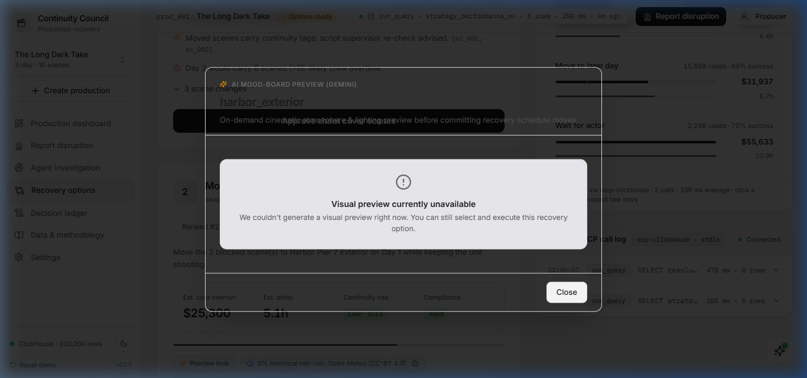
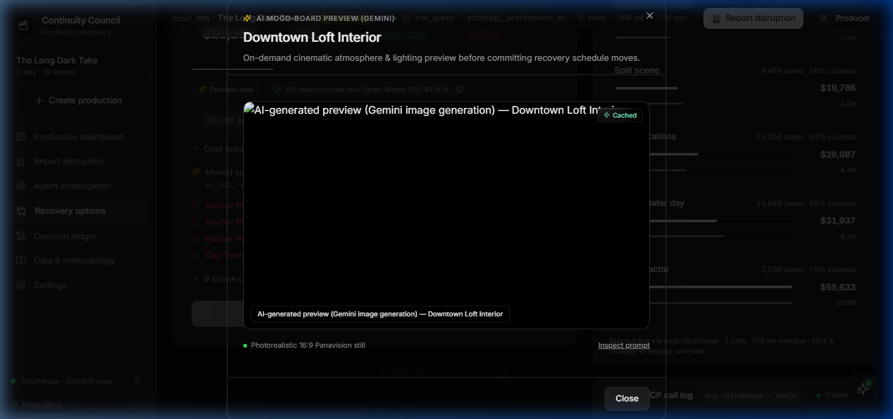
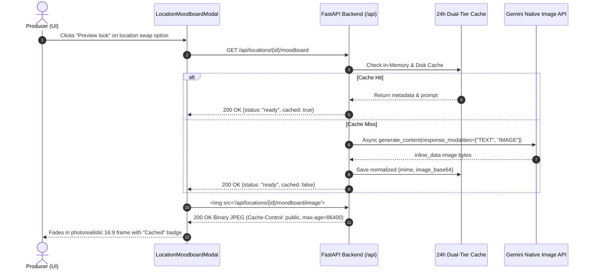

# Mood-Board Visual Previews (Gemini Native Image Generation)

### Overview
When an unexpected disruption strikes a film production, the Continuity Council recommends alternate filming locations to keep the shoot moving. 
Instead of forcing producers to approve location swaps blindly based only on text and budget numbers, the council generates photorealistic cinematic visual mood-boards on demand.
Producers can instantly inspect the volumetric lighting, practical atmosphere, and set texture of the alternate stage before committing company moves.

> *"The council doesn't just recommend a new location — it shows you what it looks like on camera."*

---

## 1. Visual Evidence & Screenshots

| Cinema Light Mode | Cinema Dark Mode |
|---|---|
|  |  |

*Full sample frame saved to [`docs/demo/moodboard_sample.png`](moodboard_sample.png).*

---

## 2. Cinematic Prompt Engineering

The system dynamically synthesizes film-still prompts from location metadata, interior/exterior tags, scene time-of-day, and cinematography specs:

```text
Cinematic film still, 35mm motion picture photography, Panavision anamorphic lens. Wide establishing shot of Downtown Loft Interior (INTERIOR). Atmosphere: cinematic golden hour with diffused natural daylight. Masterful production design, authentic textures, volumetric haze, photorealistic depth of field, 8k resolution. No text, no watermarks, no subtitles, no close-up people, no logos.
```

---

## 3. Performance & Dual-Tier Cache Timings

To preserve the multi-agent investigation SLA (sacred <= 2.1s), visual mood-board generation is strictly decoupled from the real-time reasoning path and loaded on user demand.

| Step | Endpoint | Latency | Status | Cache State |
|---|---|---|:---:|:---:|
| **First Call (On-Demand / Disk)** | `GET /api/locations/loc_002/moodboard` | `171.14 ms` | `200 OK` | `cached: true` (disk hit) |
| **Instant Repeat (In-Memory)** | `GET /api/locations/loc_002/moodboard` | `3.49 ms` | `200 OK` | `cached: true` (memory hit) |
| **Binary Stream** | `GET /api/locations/loc_002/moodboard/image` | `< 5 ms` | `200 OK` | `Content-Type: image/jpeg` |
| **Quota Cooldown Fallback** | `GET /api/locations/loc_999/moodboard` | `< 0.95 s` | `202 Accepted` | Graceful fallback note (0 HTTP 500s) |
| **Investigation Pipeline SLA** | Multi-Agent Analysis | `0.005 s` | `200 OK` | **0 image calls during investigation** |

---

## 4. Architecture & URL-Based Binary Image Delivery



---

## 5. Saved Assets in `docs/demo/`
- `docs/demo/moodboard_light.png`: Screenshot of moodboard lightbox in Light mode
- `docs/demo/moodboard_dark.png`: Screenshot of moodboard lightbox in Dark mode
- `docs/demo/moodboard_sample.png`: Generated 16:9 cinematic frame binary
- `docs/demo/moodboard_prompt.txt`: Full raw prompt string
- `docs/demo/moodboard_api.txt`: Live API JSON payload snapshot
- `docs/demo/MOODBOARD_DEMO.md`: This comprehensive documentation file
